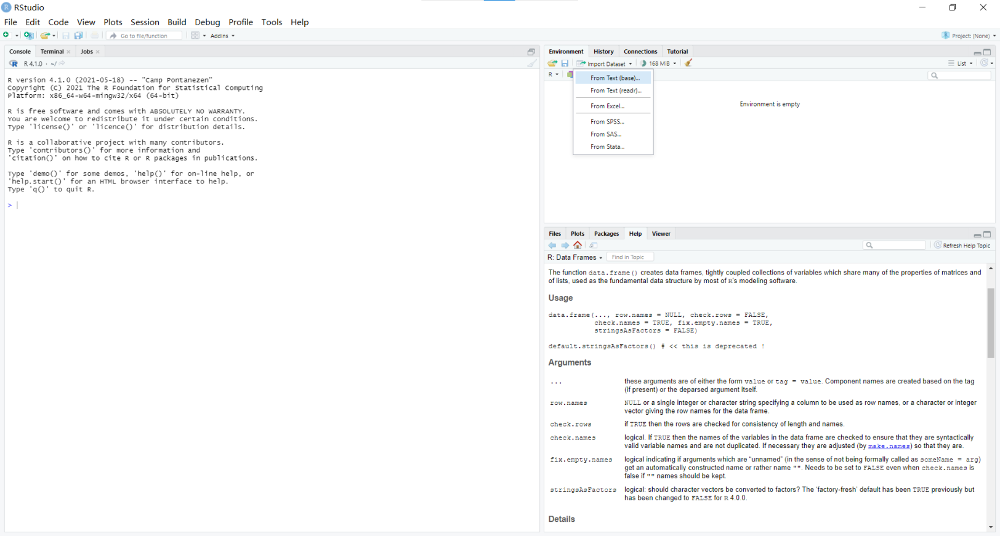
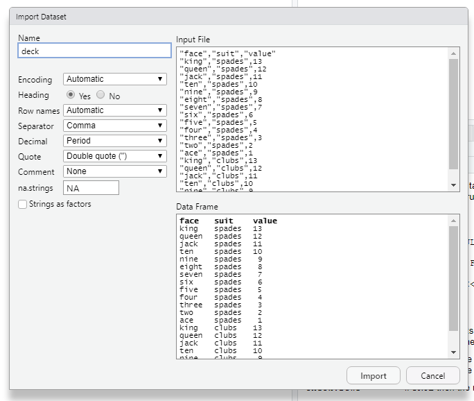

# 第3章 R对象

## 3.1 原子型向量

**原子型向量**（atomic vector）是最简单的包含数据的向量。

> `is.vector`用来测试某个对象是否为原子型向量。

R可以识别六种基本类型的原子型向量，分别是**双整型**（double）、**整型**（integerr）、**字符型**（character）、**逻辑型**（logical）、**复数类型**（complex）和**原始类型**（raw）。

### 3.1.1 双整型

双整型向量是用来储存普通的数值型数据。

在R中键入的任何一个数值都会默认以双整型存储。

`typeof`函数可以查看某个对象到底是什么类型。

有一些函数把双整型称作**数值型**（numeric）。

### 3.1.2 整型

整型向量用来存储整型的数据，整型数据的数值不需要小数点成分。

在R中，明确设定整型的方法是在该数值之后加上大写字母L。

在计算机内存中，整型的定义方式比双整型更为精确，因为有些时候精度上的微小差距会产生令人意想不到的效果。每一个双整型的数值都只会大约精确到小数点后16位，这便会带来一点小误差，比如：

```r
> sqrt(2)^2-2
[1] 4.440892e-16
```

这样的误差叫做**浮点**（floating-point）**误差**，这种情况下的运算也叫做**浮点运算**。这是计算机编程的特点，而并非R所独有。

### 3.1.3 字符型

字符型向量存储一小段文本。

在R中，字符要加双引号，组合起来构成一个字符型向量。

字符型向量中的单个元素称作**字符串**（string）。

### 3.1.4 逻辑型

逻辑型向量用来存储`TRUE`（真）和`FALSE`（假）。

这是R中布尔数据的表现形式，在对比数据时很有用。

### 3.1.5 复数类型和原始类型

复数类型向量用于存储复数。要生成一个复数类型向量只需要将某个数字与带`i`的虚数项相加即可。

原始类型向量用来存储数据的原始字节。

## 3.2 属性

**属性**（attribute）是附加给原子型向量的额外信息。也可以理解为对象的**元数据**（metadata）。

用函数`attributes`可查看一个对象包含哪些属性信息。如果没有，将会返回结果`NULL`。

一个原子型向量最常见的三个属性是：**名称**（name）、**维度**（dim）和**类**（class）。

### 3.2.1 名称属性

使用辅助函数`names`可以查询对象的**名称属性**。也可以利用辅助函数将一串字符向量赋给对象。这个字符向量的长度应该和你需要命名的对象等长。

比如给骰子的每个面命名：

```r
die <- 1:6
names(die) <- c("one","two","three","four","five","six")
```

这样骰子就有了名称属性。

```r
> die
  one   two three  four  five   six 
    1     2     3     4     5     6
```

如果想删除名称属性值，就把`NULL`赋给`names`函数即可。

### 3.2.2 维度属性

原子型向量可以转换成一个**n维数组**（array），方法是用`dim`函数将相应的维度属性赋给该向量。

在分配维度属性时，R始终将第一个值赋给行数，将第二个值赋给列数。

## 3.3 矩阵

将一个原子型向量交给函数`matrix`，该函数会把这个向量中的值重新排列到一个矩阵之中。

使用参数`nrow`定义矩阵的**行数**，也可以用`ncol`参数定义矩阵的**列数**。

`matrix`函数默认排列方式是先排满第一列再排第二列。如果需要改成**按照行优先的方式排列**，只需设置参数`byrow = TRUE`。

## 3.4 数组

`array`函数可以用来生成一个**n维数组**。

使用方法，将一个原子型向量作为第一个参数，另一个表示维度信息的向量作为第二个参数，名称是`dim`。

## 3.5 类

类是原子型向量的一个特例。

可以使用`class`函数专门搜索函数的`class`属性。

### 3.5.1 日期与时间

R用一个特殊的类来表示**日期和时间数据**。

运行`Sys.time()`可以查看结果，该结果是**双整型向量**。它的类是`POSIXct`和`POSIXt`，有**两个类**。

比如：

```r
> now <- Sys.time()
> now
[1] "2021-08-19 15:19:27 CST"

> typeof(now)
[1] "double"

> class(now)
[1] "POSIXct" "POSIXt"
```

使用`unclass`函数可以移除对象的`class`属性，让我们看到这个向量的真面目。

### 3.5.2 因子

**因子**（factor）在R中用于存储**分类信息**。

向`factor`函数传递一个原子型向量即可生成一个因子。R会将向量中的值重新编码成一串整数值，再将编码的结果储存在一个**整型向量**中。

比如：

```r
> gender <- factor(c("male","female","female","male"))
```

`unclass`函数则可帮我们查看向量是如何储存的。

```r
> unclass(gender)
[1] 2 1 1 2
attr(,"levels")
[1] "female" "male"
```

在加载或者生成数据时，R时常会尝试将字符串变量转换成因子型。一般来说需要禁止R进行转换。函数`as.character`可将一个因子强制转换成字符串。

## 3.6 强制转换

**强制转换**（coercion）：如果尝试把不同类型的数据都塞进一个向量，R会将他们全部转换成同一种类型的数据。因为原子型向量只能储存单一类型的数据。

如果一个原子型向量包含字符串，R会将该向量中所有元素都转换成字符型。如果一个原子型向量只包含逻辑型和数值型元素，R会将逻辑型全部转换成数值型，其中所有的`TRUE`值都将被转换成1，所有的`FALSE`值都将被转换成0。

一些强制转换实例：

```r
> as.character(1)
[1] "1"
> as.logical(1)
[1] TRUE
> as.numeric(FALSE)
[1] 0
```

## 3.7 列表

**列表**（list）将数据组织在一个一维集合中。

`list`函数创建列表的方式和`c`函数创建向量的方式相似，不同的元素用逗号分开。

比如创建一个列表：

```r
> list1 <- list(123:150,"R language",list(TRUE,TRUE,FALSE,TRUE,FALSE))
> list1
[[1]]
 [1] 123 124 125 126 127 128 129 130 131 132 133 134 135 136 137 138 139 140 141 142 143 144 145 146 147 148 149 150

[[2]]
[1] "R language"

[[3]]
[[3]][[1]]
[1] TRUE

[[3]][[2]]
[1] TRUE

[[3]][[3]]
[1] FALSE

[[3]][[4]]
[1] TRUE

[[3]][[5]]
[1] FALSE
```

## 3.8 数据框

**数据框**（data frame）是列表的二维版本。

如果想手动创建数据框，可以使用`data.frame`函数。比如：

```r
> Beatles <- data.frame(name=c("John","Paul","George","Ringo"),birth=c(1940,1941,1943,1940),instrument=c("guitar","bass","guitar","drums"))
> Beatles
    name birth instrument
1   John  1940     guitar
2   Paul  1941       bass
3 George  1943     guitar
4  Ringo  1940      drums
```

## 3.9 加载数据

我们可以先准备好csv文件。csv是一个**逗号分隔值**（comma-separated values）文件，是一个纯文本文件。若想在R中加载一个纯文本文件，只需要在RStudio中单击**Import Dataset**，然后选择**From text file**。 



一般不要勾选**Strings as factors**，否则R会将这些字符串变量强制转换成因子型。



然后点击Import，RStudio就会把数据储存成数据框模式。

`head`和`tail`函数可以帮我们检视数据框前或后六行数据，也可以指定一个额外参数用于指定行数。

## 3.10 保存数据

可以使用`write.csv`命令将一个数据框保存为**.csv文件**。

`write.csv`有很多参数可以选择，其中有三个是必须使用的：第一个是我们希望保存的数据框的**名称**；第二个是**文件名**，注意要带上**扩展名**；第三个是参数`row.names`，R默认在储存数据时，在数据框的开头会添加一列数字，所以我们一般设置它`row.names=FALSE`。

## 3.11 小结

R可以将数据保存为5种不同的对象，而数据框可以存储**表格型数据**（tubular data）。

RStudio的**Import Dataset**功能可以帮助我们将表格型数据加载到数据框中。

