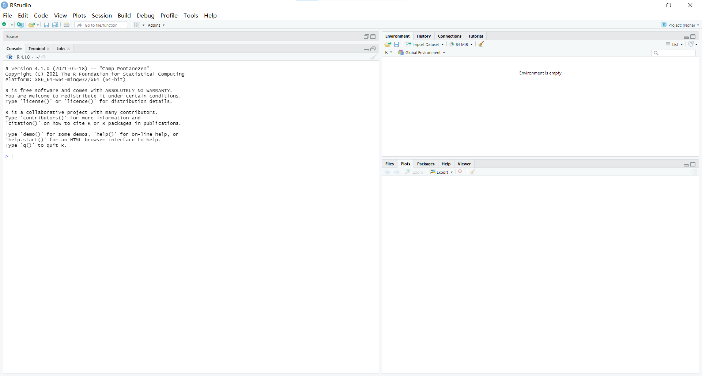

# 第1章 R基础

## 1.1 R的用户界面



**命令**（command）：键入的代码通常被称作命令。 **命令行**（command line）：键入代码所在的行。

一些简单的命令：

* `1 + 1`（求和，其他运算同理）；
* `100:130`（两个整数值之间的所有整数，生成一个数字序列的快捷方法）。

在R语言中，\#被称作**注释符号**（commenting symbol）。如果某行以\#开头，那么该行之后的所有内容不会被当成R命令执行，但是它可以提高程序本身的可读性。

> 取消命令键入“Ctrl + C”

## 1.2 对象

在R中，保存数据就是将数据储存到R**对象**（object）中。

确定一个名称，然后使用赋值符号（`<-`）将数据**赋值**给它。

* 当询问某对象是什么数据时，R会另起一行告诉你答案；
* 为对象命名并赋值之后，就可以在新命令中使用该对象了。

  > 对象命名规则：
  >
  > * 不能以数字开头；
  > * 一些特殊符号不能出现，比如^、!、$、@、+、-、/或者\*。

`ls`命令可以帮忙查看已经命名了哪些R对象。

```r
> ls()
[1] "a"      "gundam" "name"   "Name"
```

数据集也可以做一些简单的算术运算。它并非始终遵循矩阵乘法的规则，相反，R使用**元素方法执行**（element-wise execution）。

如果在一个运算中涉及两个或者两个以上的向量，R会将这些向量排成一排并执行一系列单独的运算。

```r
> 1:6 * 1:6
[1]  1  4  9 16 25 36
```

向量循环：如果两个向量长度不相等，R会在较短的向量上重复，直到其长度与较长向量相同，然后再执行运算。如果长向量的长度值不是短向量长度值的整数倍，R在返回运算结果的同时也会返回一条警告消息。

```r
> 1:2 + 1:6
[1] 2 4 4 6 6 8

> 1:4 + 1:6
[1] 2 4 6 8 6 8
Warning message:
In 1:4 + 1:6 :
  longer object length is not a multiple of shorter object length
```

向量乘法：

* 使用`%*%`执行**内乘法**

  ```r
  > 1:6 %*% 1:6
     [,1]
  [1,]   91
  ```

* 使用`%o%`执行**外乘法**

  ```r
  > 1:6 %o% 1:6
     [,1] [,2] [,3] [,4] [,5] [,6]
  [1,]    1    2    3    4    5    6
  [2,]    2    4    6    8   10   12
  [3,]    3    6    9   12   15   18
  [4,]    4    8   12   16   20   24
  [5,]    5   10   15   20   25   30
  [6,]    6   12   18   24   30   36
  ```

## 1.3 函数

为了执行一些操作，我们需要**函数**（function）。

一些自带函数的例子：

* `round`函数可以实现数字的四舍五入操作；
* `factorial`函数可以实现阶乘操作.

**参数**（argument）：传递到该函数中的数据称为该函数的参数。

掷骰子函数：`sample`函数，从向量`x`中抽取`size`个元素并返回。

```r
sample(x=1:6, size=1)
```

`args`函数可以帮忙查看某个函数所有的参数名。如果使用了一个函数无法识别的参数名，则会报错。

```r
> args(sample)
function (x, size, replace = FALSE, prob = NULL) 
NULL
```

如果调用函数时没有写出参数名称，那么R会根据顺序将输入值和函数中的参数所匹配。如果一个函数包含多个参数，详细地写出参数名称则会不管参数顺序。

## 1.4 可放回抽样

`sample`函数在抽样时默认了不可放回抽样，所以如果掷出多个骰子，它们的点数不可能一模一样。因此，我们可以设定参数`replace = TRUE`。 可放回抽样法是创建**独立随机样本**（independent random sample）的一种简单方法。

```r
> sample(x=1:6, size=2, replace=TRUE)
[1] 6 2
```

这样，我们就模拟了一对骰子。

如果想要模拟掷一对骰子的总点数，只需要将模拟的结果交给sum函数。

```r
> dice <- sample(x=1:6, size=2, replace=TRUE)
> dice
[1] 1 2
> sum(dice)
[1] 3
```

但是在`dice`生成之后，每次调用时不会生成一对新的点数。因为`sample`函数抽样之后把点数赋给了`dice`，而之后再次调用`dice`，R不会重新运行一次`sample`以生成一堆新的点数。

## 1.5 编写自定义函数

任何一个R函数都包含三个部分：**函数名**、**程序主体**和**参数集合**。 编写自定义函数要使用`function`函数，具体做法是调用`function()`函数，并在后面加一对`{}`。

比如构建掷一对骰子求总点数的函数：

```r
roll <- function(){
  dice <- sample(x=1:6, size=2, replace=TRUE)
  sum(dice)
}
```

这样直接调用`roll()`函数就能使用这个自定义函数了。

而如果要查看这个函数所储存的代码，直接在R控制台键入函数名即可。

```r
> roll
function(){
dice <- sample(1:6, size=2, replace=TRUE)
sum(dice)
}
```

## 1.6 参数

我们可以在自定义函数中设置任意数量的参数，只要在`function`后的括号中列出它们的名称，并用逗号隔开即可。

但是如果调用自定义函数时不提供参数值，那么该函数会触发错误信息。

## 1.7 脚本

我们可以通过R脚本（script）创建代码草稿。 在RStudio中，依次点击**File &gt; New File &gt; R Script**来创建一个新的R脚本。

R脚本的好处：

* 可以更好地编辑R代码；
* 让我们所有的工作都有案可查，并且再现性强；
* 便于编辑和校对工作，而且便于分享给他人。

运行：

* 想运行某一行代码，只需要单击**Run**按钮即可。如果想运行一整段代码，那么选中这段代码再点击**Run**按钮；
* 如果想运行脚本里的所有代码，单击**Source**按钮。快捷键组合：**Ctrl + Enter**。

> 提取函数 将脚本中想转换为函数的代码对应段选中，然后在菜单栏中选择**Code &gt; Extract Function**即可。 RStudio会询问你想给函数起什么名称，然后将选中的代码段用`function`函数包装起来。它会自动检查代码段中没有定义的变量，并将它们设置为该函数的参数。

## 1.8 小结

R语言有两个重要的组成部分：

* **对象**：用于储存数据；
* **函数**：用于操作数据。

