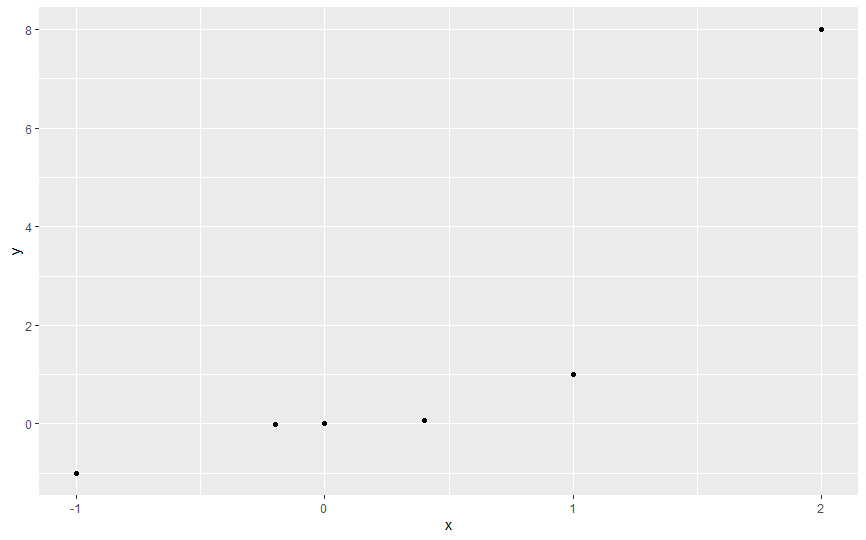
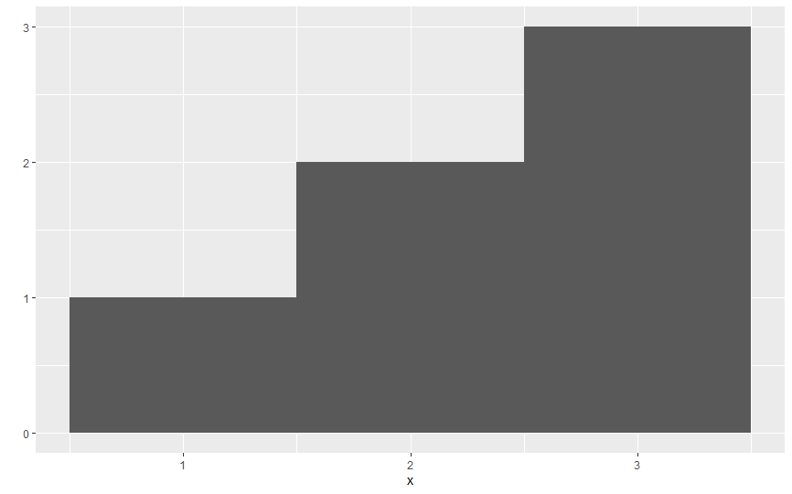
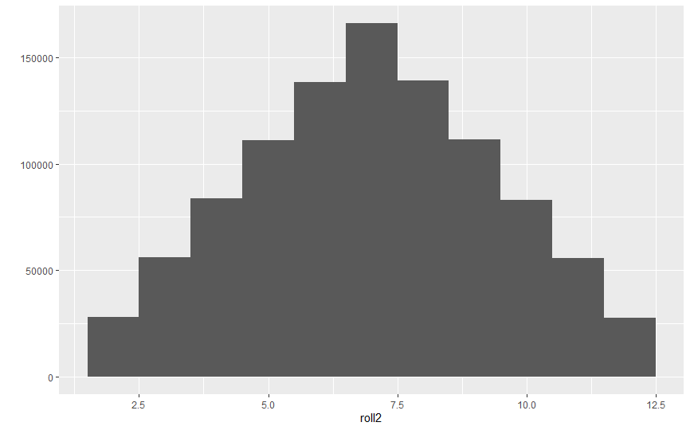
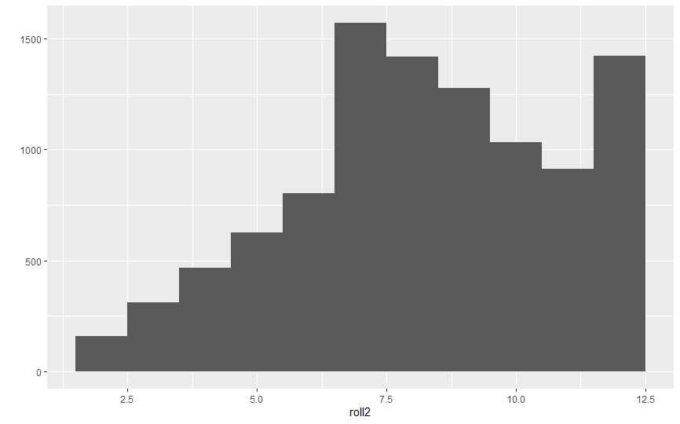

# 第2章 R包与帮助文档

数据科学的两个超能工具：**重复**（repetition）和**可视化**（visualization）。

我们可以调用`replicate`函数重复掷一对骰子，并用一个叫做`qplot`的函数将抛掷结果可视化。 但是`qplot`函数并不是R自带的函数，它来自一个独立的R包。

## 2.1 R包

在使用**R包**或者**R包**中任何一个函数之前，我们需要先下载并安装R包。

### 2.1.1 `install.packages`

步骤：

1. 打开RStudio；
2. 确保计算机连接到了互联网；
3. 在命令行窗口内运行命令`install.packages("ggplot2")`。

如果想要安装其他包，只需将命令代码中`ggplot2`改成其他包的名字即可。

### 2.1.2 `library`

安装完包之后，包并非立即可用，而是需要利用命令`library("ggplot2")`加载该包。如果想加载其他包，只需要将命令中的`ggplot2`替换为对应的R包名称即可。 加载R包时没有信息就代表一切正常，只要没见到类似“Error”的信息就代表操作没有问题。

每个包都只需安装一次，但是在每个新的R会话中，使用这个包之前都应该先用`library`命令加载一次，因为每次关闭RStudio时R都会把所有已经加载的包从当前R会话中卸载。

#### `qplot`

`qplot`的意思：快速绘图（quick plot）。

如果把两个长度相同的数值向量交给`qplot`函数，他就会绘制出一幅散点图，然后显示在RStudio窗口右下角面板的Plots选项卡中。

> 使用`c`函数可以创建数值向量：`c`代表连接（concatenate），或者收集（collect）、合并（combine）。

例如，编写以下代码：

```r
x <- c(-1, -0.2, 0, 0.4, 1, 2)
y <- x^3
qplot(x,y)
```

可得到散点图： 



> 我们未必需要`x`和`y`来命名这两个向量。

将`x`和`y`中的值一一对应起来得益于R的**元素方法执行**。

**直方图**（histogram）用来可视化单一变量的分布情况。绘制方法：仅给`qplot`函数一个要绘制的向量。为保证图的一致性，我们给代码设置一个参数`binwidth =1`。 例如，编写以下代码：

```r
x <- c(1, 2, 2, 3, 3, 3)
qplot(x, binwidth = 1)
```

可得到直方图： 



#### `replicate`

`replicate`函数提供了快速重复运行一段R命令的快捷方法。我们需要提供需要**重复的次数**，以及需要**重复运行的R代码**。这样`replicate`函数会将结果储存为一个**向量**。

比如将掷一对骰子并求和的过程重复10000次，并绘制出直方图的代码如下：

```r
roll <- function(){
  die <- 1:6
  dice <- sample(die, size=2, replace=TRUE)
  sum(dice)
}
roll2 <- (10000, roll())
qplot(roll2, binwidth=1)
```

这样可以得出直方图： 



 直方图的结果看出这对骰子是均匀的。

## 2.2 从帮助页面获取帮助

> 如果一个函数来自R包，而我们并未安装或加载该包，那么在R的控制台中用`?`加函数名的方式无法调出该函数的帮助页面。

### 2.2.1 帮助页面的组成部分

通常帮助界面分为以下几个部分：

* **函数描述**（Description）：一段简短的有关该函数的描述；
* **使用方法**（Usage）：如何键入该函数和相应的参数名；
* **参数**（Arguments）：列出该函数包含的所有参数，及其所接受的赋值类型和每个参数的作用；
* **相关细节**（Details）：关于该函数工作原理的进一步描述；
* **返回值**（Value）：一段关于该函数运行后的返回值的简短描述；
* **另请参阅**（See Also）：与该函数相关的函数列表；
* **代码示例**（Examples）：确保可以无错运行的代码示例。

如果忘了函数确切名称又想调出帮助界面，我们可以尝试**关键词搜索**，即在关键词之前加两个问号。

```r
??log
```

如果我们想知道如何给`sample`函数的每一项**加权**，我们首先调出`sample`函数的帮助界面：

```r
?sample
```

这样我们就能得到相关信息，去设置`sample`函数的`prob`参数，`prob`参数是一个**包含权重的向量**。例如，我们将骰子的六个面权重分别设置为1/8，1/8，1/8，1/8，1/8和3/8，然后掷一对骰子并求点数和。代码如下：

```r
roll <- function(){
  die <- 1:6
  dice <- sample(die, size=2, replace=TRUE, prob=c(1/8, 1/8, 1/8, 1/8, 1/8, 3/8))
  sum(dice)
}
roll2 <- replicate(10000, roll())
qplot(roll2, binwidth=1)
```

这样就可以得到直方图： 



### 2.2.2 获取更多帮助

可以在**R帮助邮件列表**（[https://stat.ethz.ch/mailman/listinfo/r-help](https://stat.ethz.ch/mailman/listinfo/r-help)）中提问。但是为了避免重复提问，建议在提问之前在**已提问题存档**（[https://tolstoy.newcastle.edu.au/R/](https://tolstoy.newcastle.edu.au/R/)）中搜索确认一下。

相比R邮件列表，**Stack Overflow**（[http://stackoverflow.com](http://stackoverflow.com)）的帮助模式更好。

## 2.3 小结

R中的包和帮助页面可以帮助我们成为一个更高效的程序员。

R的帮助页面能够帮助我们掌握R和R包中函数的使用方法。

## 2.4 项目1总结

R语言的名词是对象，而动词是函数（参数则作为副词）。

